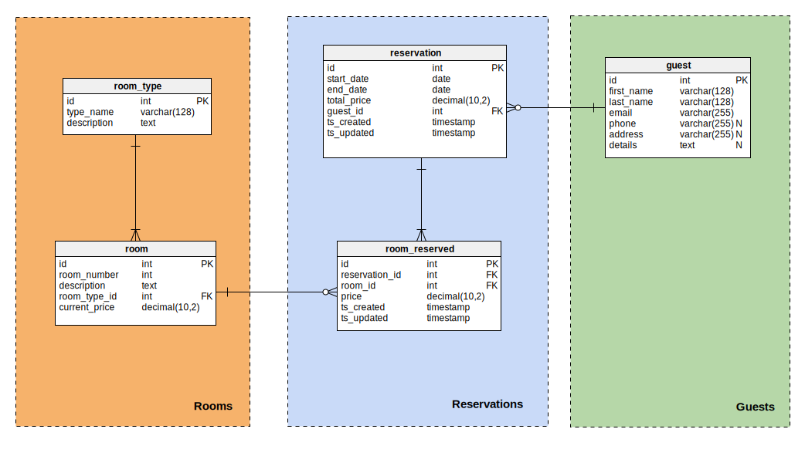

# Hotel Reservation System

## Data Model

## How to Use

Run `App.java` to start the program. Input commands in the console.

| Commands                     | Description                                                             |
| :--------------------------- | ----------------------------------------------------------------------- |
| `check roomtype available` | Return available rooms with given room type available on a given date   |
| `change price`             | Change the price of a range of rooms (by room number, e.g. rooms 10-15) |
| `apply discount`           | Apply a special offer price to a range of rooms                         |
